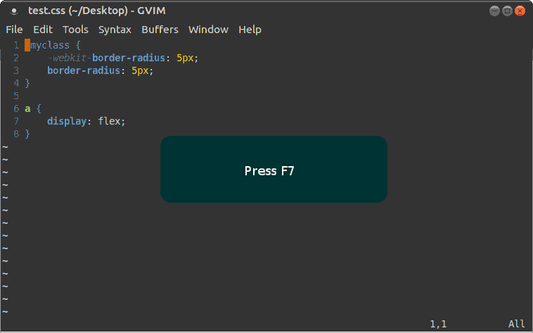

# vim-autoprefixer

Adds [autoprefixer](https://github.com/ai/autoprefixer) support to [Vim](http://www.vim.org/).


About
-----



With vim-autoprefixer you can use the power of Autoprefixer without leaving vim. Write your CSS and add vendor prefixes automatically using values from [Can I Use](http://caniuse.com/). Autoprefixer utilizes the most recent data from Can I Use to add only necessary vendor prefixes. It also removes old, unnecessary prefixes from your CSS.

vim-autoprefixer plugin works in normal and visual vim mode. Select a block of CSS code in visual mode hit F7 and apply prefixes on it, in normal mode the plugin processes the entire file.

Note that vim-autoprefixer interact with the user and promt for Autoprefixer options, if you don’t set any option and hit Enter vim-aytoprefixer continue with Autoprefixer default settings.


</br>

Install
------------

vim-autoprefixer requires **[Node.js](http://nodejs.org)>=0.12.0** and **[Postcss](https://github.com/postcss/postcss)** plugin **[Autoprefixer-cli](https://github.com/postcss/autoprefixer)** installed on your system.
</br>

**Install** and **test** `autoprefixer-cli` to make sure it's running properly.

```
npm install --global postcss-cli autoprefixer
postcss --use autoprefixer *.css -d build/
```

**Install** `vim-autoprefixer`.

You can install the plugin manually, just extract the zip file and place the content files in your .vim subfolders.


Place in ~/.vim/plugin/`vim-autoprefixer.vim`</br>
and in ~/.vim/doc/`vim-autoprefixer.txt`

 Or you can install it with [Vundle](http://github.com/gmarik/vundle) or [Pathogen](https://github.com/tpope/vim-pathogen)

</br>

Usage
-----

### Add vendor prefixes in entire file
First of all open an existing CSS file or write some from scratch:

```css
.myclass {
    -webkit-border-radius: 5px;
    border-radius: 5px;
}

a {
    display: flex;
}
```
*  Press ESC to set vim in normal mode.
*  Press F7
*  vim-autoprefixer executing and waiting for options

```bash
Add vendor prefixes to CSS rules
Hit ENTER or you can add Autoprefixes CLI Options
Enter options :
```
*  Just press ENTER and view your buffer to change in this:

```css
.myclass {
    border-radius: 5px;           
}

a {
    display: -webkit-box;         
    display: -webkit-flex;           
    display: -ms-flexbox;         
    display: flex;
}
```
Before you press ENTER you can set some options:

```bash
Add vendor prefixes to CSS rules
Hit ENTER or you can add Autoprefixes CLI Options
Enter options :--autoprefixer.browsers "> 5%" 
```
Your CSS code now prefixed like this:

```css
.myclass {
    border-radius: 5px;
}

a {
    display: -webkit-box;
    display: flex;
}
```
</br>
### Add vendor prefixes in selected items
Like the previus example write some CSS code:

```css
.myclass {
    -webkit-border-radius: 5px;
    border-radius: 5px;
}

a {
    display: flex;
}
```
* Press ESC to exit insert mode.
* Press v and select the entire class or use your mouse.
* Press F7
* Hit ENTER

Vendor prefixes added only in the class:

```css
.myclass {
    border-radius: 5px;
}

a {
    display: flex;
}
```
</br>


License
-------

#### The [MIT](https://github.com/Ioannis-Kapoulas/vim-autoprefixer/blob/master/LICENSE) License (MIT)
